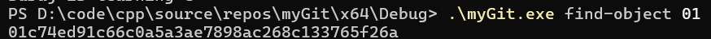
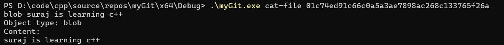
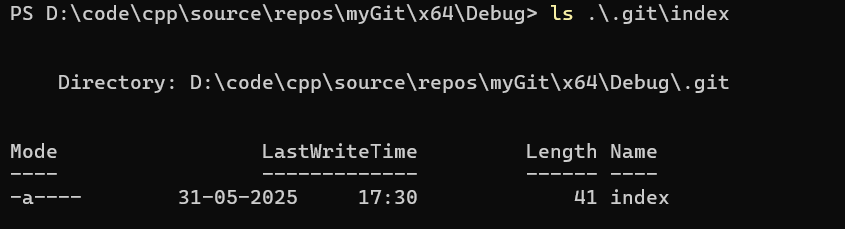
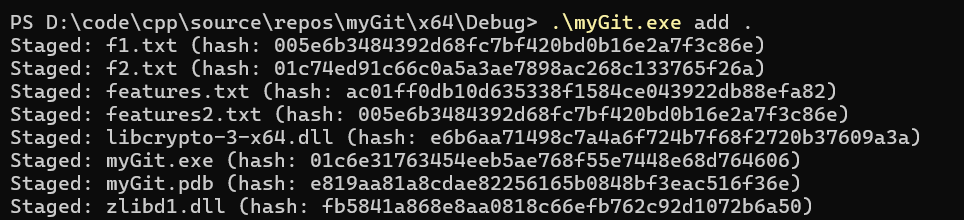

WIP

implementation done till now 
1. init

2. hash-object

4. find-object hash

5. cat-object hash -> works for only blobs for now

6. git add

implementing next 
1. cat on tags , commits , trees
2. commit
3. diff
4. status
5. push stuff to github
6. add
7. refactor code
8. add error handling
9. singleton class + other patterns learn & see how to refactor accordingly 
