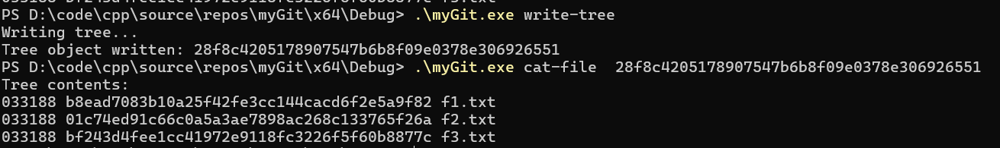
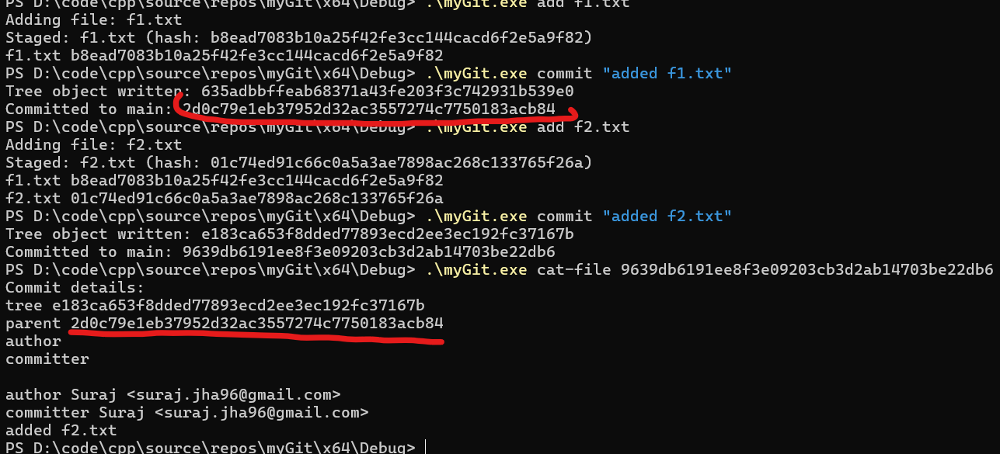

# Custom Git Implementation

A WIP implementation of a simplified Git client in C++. 

## directory looks like this before executing any commands 

## Implemented Features

1. **git init**  
   

2. **git hash-object file**
   

3. **git find-object hash**  
  
   

4. **git cat-object hash**  
   Displays the contents of a Git object (currently supports blobs only).  
   

5. **git add**  
     
     
     
   

6. **git ls-files**  
   

7. **git status**  
   Shows the status of the working directory and staging area.  
   *Before changes*:  
     
   *After changes* (removed `features.txt`, added `f3.txt`, modified `f1.txt`):  
   

7. **git diff**
   *changes* (edited `f1.txt`):    

8. **git write-tree**
   Writes tree 
   

9. **git commit**
   

## Planned in Future

1. refactor code
2. add error handling - ignored all / any edge cases for now 
3. singleton class
    - learn other design patterns & refactor accordingly

## learnings
1. Would have been better to add test / edge cases handling from the start , now I have forgotten what assumptions i took . Never doing this again 
2. Learnt c++ while implementing this , fun :) , now i think i will pick up a book 
3. Deeper understanding of how GIT works under the hood. I simplified some optimisations for storing index . Did not add multi branch feature for now.

### Prerequisites
- C++17
- zlib for compression
- openssl for sha1